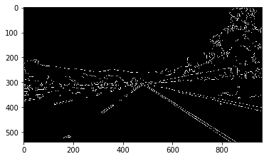
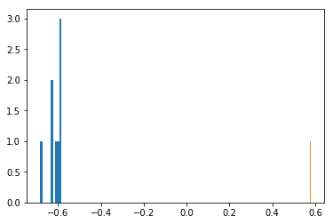

#**Finding Lane Lines on the Road** 

##Writeup Template

---

**Finding Lane Lines on the Road**

The goals / steps of this project are the following:
* Make a pipeline that finds lane lines on the road
* Reflect on your work in a written report


[//]: # (Image References)

[image1]: ./examples/grayscale.jpg "Grayscale"
[image2]:./ouput/

---

### Reflection

###1. Pipeline Summary.

My pipeline consisted of the following steps:
1. Packages
2. Read in an Image
3. Helper Functions
4. Image transform to grayscale
5. Gauss/Canny Filtering
6. Image Masking
7. Hough Transform
8. Parameterizing the lines
9. Selecting the most probable lines
10. Sum the weighted angles and y-interesects
11. Draw the resulted lines

###2. Pipeline Description

####a. Packages

The needed imports in order to have the project workin

```
import matplotlib.pyplot as plt
import matplotlib.image as mpimg
import numpy as np
import cv2
import math
```

and the additional libraries to work with video


```
from moviepy.editor import VideoFileClip
from IPython.display import HTML
```

####b. Helper Functions
To make the code easier to understand, a serie of functions need to be added. These are now summarized:

**`def grayscale(img):`**
Applies the Grayscale transform to the input image/frame

**`def canny(img, low_threshold, high_threshold):`**
Applies the Canny transform

**`def gaussian_blur(img, kernel_size):`**
Applies a Gaussian Noise kernel

**`def region_of_interest(img, vertices):`**
    Applies an image mask, based on the closed polygon declared.

**`def draw_lines(img, lines, color=[255, 0, 0], thickness=2):`**
This function draws `lines` with `color` and `thickness`.    
Lines are drawn on the image inplace (mutates the image).

**`def hough_lines(img, rho, theta, threshold, min_line_len, max_line_gap):`**
This function returns an image with hough lines drawn.

**`def weighted_img(img, initial_img, α=0.8, β=1., λ=0.):`**
This function calculate an image as result of the combination of two original images (initial_img * α + img * β + λ)

**`def drawline_alphab(lines, img, boty, topy):`**
    This function draws `lines` with `color` and `thickness`
    based on its slope and the y-intercept.

**`def line_length(V):`**
This function receive the two coordinates of a line and return its lengths

**`def weigthed_sum(Lines):`**
    This funtion calculates the weighted sum of lines stored in alpha angle of inclination  B as its y-intercept and L its lengths.
    Returns an [int a, int b] with the total sum of the angle and the y-intercept

####c. Read in an Image
This is the single point of start of the image input or frame to be processed
<p></p>

####d. Image transform to grayscale
The image is transformed to a grayscale one


![alt text][image1]

####e. Gauss/Canny Filtering
The image/frame is then filtered to obtain the borders as a preprocess to the hough transform
<p></p>

####f. Image Masking
To avoid innecesary noise and external elements, the image is masked with a closed polygon around the Region of Interest (ROI)
<p></p>

####g. Hough Transform
Now we are ready to apply the hough transform
<p></p>

####h. Parameterizing the lines
With the simplified image, now we parameterizied the lines detected usin the output of the hough_lines function. After that we make the histogram of the slopes to obtain the most likely line clasified by the sign of the slope.
<p></p>

####i. Selecting the most probable lines
The peak bin is selected and the lines within this range are extracted.

####j. Sum the weighted angles and y-interesects
To obtain an unique line, the selected lines are added but weigthed based on the length of the line

####k. Draw the resulted lines
Finally the 2 resulting lines are overimposed on the original image
<p></p>

###2. Identify potential shortcomings with your current pipeline

- One potential shortcoming would be what would happen when noise is introduced in the image. As can be observed in the video of the challenge, during a shadowed portion of the street aditional lines are included and produce impredictable bahavior

- Another shortcoming is that the lines obtained for a video are a bit noisy and moves a tiny quantity of pixels. Even though, the result is still valid is a little unconfortable to the eye.

- A possible shortcoming is the fact that both lines are draw to the same height, this could be personalized for each line.


###3. Suggest possible improvements to your pipeline

- A possible improvement would be to modify the contrast of the initial image in order to obtain some inmunity to smalls lines produced by shadows.

- Another potential improvement could be to store the historic of the previous frame lines and combine them in time, this way the vibration of the lines could be Significantly reduced.

- The different height sizes could help to represent curves, in wich one side could be more aproximated to a line than the other.
